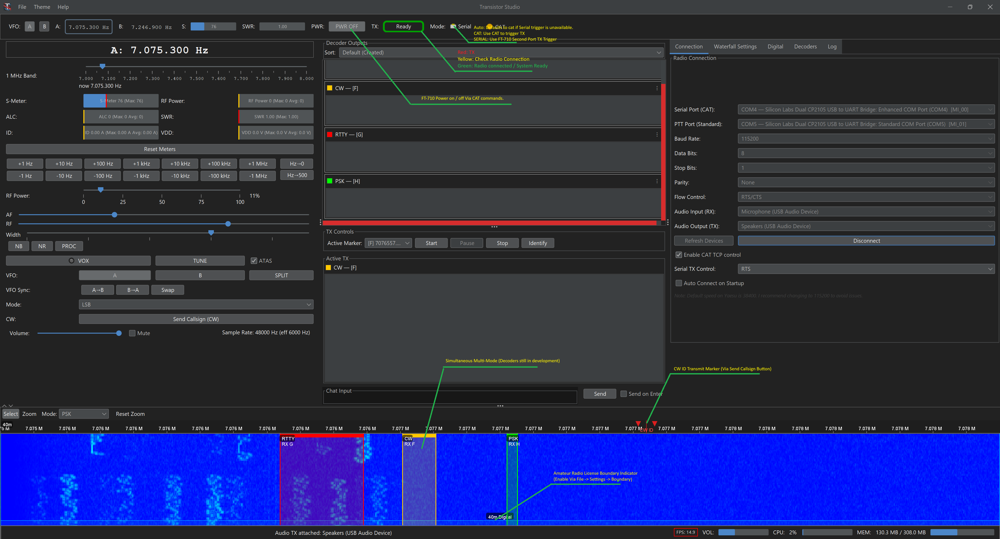

# Transistor Studio



Transistor Studio is a modern, cross-platform software suite for amateur radio operators, focusing on digital modes, radio control, and advanced signal processing. Built in Java with a clean Swing UI, it aims to provide a powerful and extensible platform for digital operations.

---

### ⚠️ Beta Software Notice

This is a **beta release** of Transistor Studio. While many features are functional, the software is still under active development. You may encounter bugs, performance issues, or incomplete features.

In particular, the **digital mode decoders (RTTY, PSK, CW)** are a primary focus of ongoing improvement. Their performance may vary, and they might not decode weak or noisy signals as reliably as mature software like Fldigi.

Your feedback and bug reports during this phase are invaluable!

---

## Features

### 📡 Radio Control & Hardware Integration
*   **Untested - Universal Rig Support (Hamlib):** Deep integration with `rigctld` for out-of-the-box compatibility with thousands of amateur radio transceivers.
*   **Native Serial CAT Control:** Direct hardware control (optimized for Yaesu), including VFO A/B management, Split operation, Mode switching, and filter bandwidth adjustments.
*   **Comprehensive Metering:** Real-time polling and visualization of S-Meter, SWR, ALC, RF Power, Drain Current (ID), and Voltage (VDD).
*   **Hardware & Software PTT:** Automatic fallback PTT routing, supporting pure CAT commands or dedicated hardware COM port toggling (RTS/DTR).
*   **Smart Audio Device Management:** "Sticky" audio routing that saves and automatically recovers your soundcard connections.

### 🌊 Waterfall & Visualizations
*   **High-Performance Spectrogram:** CPU-based waterfall display with customizable color themes and adjustable refresh rates up to 60 FPS.
*   **Multi-Threaded FFT Engine:** Scalable FFT processing that automatically utilizes available CPU cores.
*   **Interactive Baseband Tuning:** Place, drag, and resize markers directly on the waterfall to isolate signals for decoding.
*   **Zoom-linked Processing:** The audio decimation engine dynamically optimizes FFT resolution based on the user's zoom level.

### 📻 Digital Modes & DSP
*   **Multi-Signal Decoding:** Drop multiple markers on the waterfall to decode numerous distinct signals simultaneously.
*   **(In Development)Advanced CW (Morse Code):**
    *   *K-Means Auto-Speed:* Machine-learning driven WPM detection that adapts to an operator's "fist".
    *   *CW Auto-Correct:* Lucene-backed spellchecker with a Morse-aware error model to fix dropped dits and dahs.
*   **(In Development)High-Fidelity RTTY:** AFSK encoder/decoder with dual damped Goertzel resonators and an **Autodetect Engine** to lock onto wandering Mark/Space shifts and Baud rates.
*   **(In Development)Robust PSK31:** BPSK Costas loop for phase tracking and Gardner timing recovery.

### 🌐 Networking & External Services
*   **VARA HF / VXP Integration:** Built-in KISS/VXP client to connect to VARA HF modems for ARQ file transfers and mesh networking.
*   **PSK Reporter Spotting:** Automated IPFIX telemetry exporter to spot decoded callsigns to the PSKReporter global network.
*   **CAT-over-TCP Server:** Allows third-party logging software (like N1MM or Log4OM) to control your radio through the app (Tested with VarAC).

### 📝 Logging & UI Workflows
*   **Automated Callsign Extraction:** Continuously analyzes decoded text to intelligently scrape and verify amateur callsigns.
*   **Unified Chat Interface:** A modern, real-time chat UI for sending and receiving digital text.
*   **Band Plan Guardrails:** Built-in safety checks to warn or block transmission outside of your configured license class privileges.

## Getting Started

### Prerequisites
*   **Java 17** or newer.
*   (Optional but Recommended) **Hamlib** installed if you wish to use `rigctld` for radio control.

### Running the Application

> **Note:** Transistor Studio is primarily developed on Windows. It has not been formally tested on macOS or Linux, though it is expected to run via the `.jar` file. Your feedback on these platforms is especially welcome!

1.  Download the `TransistorStudio-1.0-SNAPSHOT.jar` file from the latest GitHub Release.
2.  Open your terminal (Terminal on macOS/Linux, Command Prompt or PowerShell on Windows) and navigate to the directory where you downloaded the file.
3.  Run the application:
    ```sh
    java -jar TransistorStudio-1.0-SNAPSHOT.jar
    ```
4.  On first launch, navigate to the **Connection** tab to configure your radio's serial port and your audio input/output devices.

### Using Hamlib
For universal radio support, you can run Hamlib's `rigctld` daemon in the background.

1.  Start `rigctld` with the appropriate model number and port for your radio. For example, for a Yaesu FT-710 on COM3:
    ```sh
    rigctld -m 1043 -r COM3 -s 38400
    ```
2.  In Transistor Studio, go to the **Connection** tab and select **"Hamlib (rigctld)"** from the "Serial Port (CAT)" dropdown.
3.  Click **Connect**.

## Contributing

This project is open source and contributions are welcome! Feel free to open an issue to report a bug or suggest a feature.

## License

This project is licensed under the **GNU General Public License v3.0**. See the LICENSE file for details.
